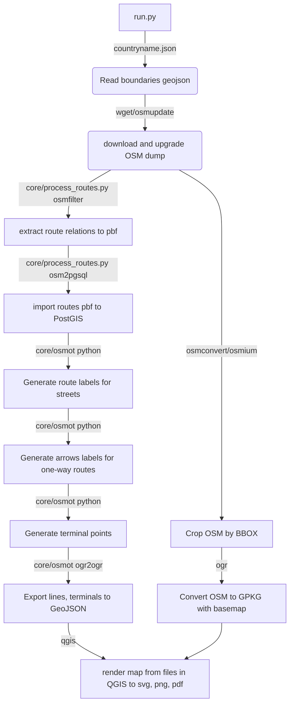

# OSMTram
Generate transit maps from OSM data in docker

<!--
[![Contributors][contributors-shield]][contributors-url]
[![Forks][forks-shield]][forks-url]
[![Stargazers][stars-shield]][stars-url]
[![Issues][issues-shield]][issues-url]
[![MIT License][license-shield]][license-url]
[![LinkedIn][linkedin-shield]][linkedin-url]
-->


<!-- PROJECT LOGO -->

<!--
<br />
<p align="center">
  <a href="https://github.com/othneildrew/Best-README-Template">
    
  </a>
<!--
  <h3 align="center">Best-README-Template</h3>

  <p align="center">
    An awesome README template to jumpstart your projects!
    <br />
    <a href="https://github.com/othneildrew/Best-README-Template"><strong>Explore the docs »</strong></a>
    <br />
    <br />
    <a href="https://github.com/othneildrew/Best-README-Template">View Demo</a>
    ·
    <a href="https://github.com/othneildrew/Best-README-Template/issues">Report Bug</a>
    ·
    <a href="https://github.com/othneildrew/Best-README-Template/issues">Request Feature</a>
  </p>
</p>
-->


<!-- TABLE OF CONTENTS -->
## Table of Contents
<!--
* [About the Project](#about-the-project)
  * [Built With](#built-with)
* [Getting Started](#getting-started)
  * [Prerequisites](#prerequisites)
  * [Installation](#installation)
* [Usage](#usage)
* [Roadmap](#roadmap)
* [Contributing](#contributing)
* [License](#license)
* [Contact](#contact)
* [Acknowledgements](#acknowledgements)

-->

<!-- ABOUT THE PROJECT -->
## About The Project

[![Product Name Screen Shot][product-screenshot]](https://example.com)

There are many great public transport routing services online, however, I stil need static maps of public transit lines. I want to create a automatic process for generate static maps from OpenStreetMap data, with simply running routine.

Here's why:
* Changes of public transport lines become quickly, but transit authorities news resourses do not provide up-to-date maps, only text descriptions.
* Public transport routing services solve one problem: how to get to specific address. A map of all lines solve diffirent problem: where i can go from some point.
* Old maps may disappear from Internet, due to closed licensing, and no one can copy it. A maps generated from OpenStreetMap keep open license, and can be reproduced to many resources.
* Public Transport lines information in OSM keeps from 2010-s, so historical map generation already possible.

A data features, needed to orientation by static public transport map is

1. Geometry of lines, with route refs
2. Places of terminus, with route refs and names.
3. Directions for one-line lines.
4. Interval information, or marking of low interval lines.
5. Date of map source.
6. Good looking basemap withouth distracting map features, like "boundary of national parks".

This scripts provive points 1, 2, 3, calculating from OSM data. And also 5 and 6.

### Built With
This section should list any major frameworks that you built your project using. Leave any add-ons/plugins for the acknowledgements section. Here are a few examples.
* [PostGIS](https://postgis.net/)
* [Docker](https://www.docker.com/)
* [Python](https://www.python.org/)
* [QGIS] (https://qgis.org/)


<!-- GETTING STARTED -->
## Getting Started

<!--### Prerequisites -->

### Installation in docker (prod)

This script run in Docker container, witch can be run on any modern OS.

Install git. Here is git submodules, download zip from github will not work. See https://github.com/git-guides/install-git

```
git clone  --recurse-submodules https://github.com/trolleway/OSMTram.git
cd OSMTram
docker build -t osmtram:1.0 .

#start postgis container
docker run --rm   --name osmtram_backend_db -e POSTGRES_PASSWORD=user -e POSTGRES_USER=user -e POSTGRES_DB=gis -d -p 5432:5432   mdillon/postgis

#start and go to container with ubuntu+python+gdal, with network link to postgis
docker run --rm -it --link osmtram_backend_db:db -v ${PWD}/data:/data   osmtram:1.0  /bin/bash
# on Windows run in powershell
```

# Into container
```
time python3 run.py russia.json --workdir /data  --basemap-caching --where "name_int='Volgograd' and route='tram'"
```

### Installation in docker (develop)
Same as prod, but mount code folder to container, no need to rebuild container at code change

```
git clone  --recurse-submodules https://github.com/trolleway/OSMTram.git
cd OSMTram
docker build -f Dockerfiledev -t osmtram:dev .


#run postgis in docker
docker run --rm   --name osmtram_backend_db -e POSTGRES_PASSWORD=user -e POSTGRES_USER=user -e POSTGRES_DB=gis -d -p 5432:5432   mdillon/postgis

#win
docker run --rm -it --link osmtram_backend_db:db -v ${PWD}/data:/data -v ${PWD}:/OSMTram osmtram:dev  /bin/bash
```

## Map style change

Script start QGIS in docker container, make copy of QGIS project from /qgis_project_templates, put data layers into gpkg files, and run QGIS operation "Atlas rendering".
If you wish change map appearance, open and edit qgis_project_templates/manila.qgs.template.qgs in QGIS. There is sample layers for map styling already in that folder.

## Examples

```
time python3 run.py italy-sud.metadata.json --workdir /data
time python3 run.py poland.json --skip-osmupdate --workdir /data --where "name_int = 'Gdansk'"
time python3 run.py russia.json --skip-osmupdate --basemap-caching --workdir /data --where "name_int = 'Ekaterinburg' and route='tram'"
time python3 run.py russia.json --basemap-caching --workdir /data --where "name_int = 'Ekaterinburg' and route='trolleybus'"
time python3 run.py russia.json --skip-osmupdate --workdir /data --where "not valid"

```

## Edit map style

1. Download QGIS and open one of .qgs projects in /qgis_project_templates/
2. There is sample data layers for some typical city. You can edit layers symbolics and label properties. 
3. Overwrite .qgs project or save to new project and add refrences into core/processor.py

At next run a map will rendered using changed project

<!-- USAGE EXAMPLES -->
## Detailed description



This is a docker container. It uses for input a bbox, filter string and map style, and generate a png image file.

It consists from there scripts:

* core/dump_prepare.py - Takes a url or pbf file, poly file, filter string, and filtering it to basemap.pbf and pt_data.pbf. Use osmfilter.
* core/historical_dump.py - Download and prepare historical dump for dump_prepare. May will be run outside container, due to huge size of dumps. Use osmupdate and osmfilter.
* core/basemap_process.py - Generate image of basemap for bbox. Importing basemap.pbf to postgis, create QGIS Server WMS, make png from WMS.
* core/pt_data_process.py - Generate image of public transport map

* core/pyqgis_client_atlas.py - render pdf/svg/png map using standart qgis project with atlas layout. Extent is set in geojson file.
    One run generate one-page atlas, then pages combined in multi-page pdf or zip archive

### Deprecated scripts, should be removed

* core/pyqgis_client.py
* core/qgis_project_substitute.py
<!--

Use this space to show useful examples of how a project can be used. Additional screenshots, code examples and demos work well in this space. You may also link to more resources.


_For more examples, please refer to the [Documentation](https://example.com)_
-->


<!-- ROADMAP -->
## Roadmap


<!-- CONTRIBUTING -->
## Contributing


<!-- LICENSE -->
## License

Distributed under the MIT License. See `LICENSE` for more information.


<!-- CONTACT -->
<!--## Contact

Artem Svetlov - [@trolleway](https://twitter.com/trolleway) - trolleway@yandex.ru


<!-- ACKNOWLEDGEMENTS -->
<!--## Acknowledgements
* [GitHub Emoji Cheat Sheet](https://www.webpagefx.com/tools/emoji-cheat-sheet)
* [Img Shields](https://shields.io)
* [Choose an Open Source License](https://choosealicense.com)
* [GitHub Pages](https://pages.github.com)
* [Animate.css](https://daneden.github.io/animate.css)
* [Loaders.css](https://connoratherton.com/loaders)
* [Slick Carousel](https://kenwheeler.github.io/slick)
* [Smooth Scroll](https://github.com/cferdinandi/smooth-scroll)
* [Sticky Kit](http://leafo.net/sticky-kit)
* [JVectorMap](http://jvectormap.com)
* [Font Awesome](https://fontawesome.com)-->


<!-- MARKDOWN LINKS & IMAGES -->
<!-- https://www.markdownguide.org/basic-syntax/#reference-style-links -->
<!--[contributors-shield]: https://img.shields.io/github/contributors/othneildrew/Best-README-Template.svg?style=flat-square
[contributors-url]: https://github.com/othneildrew/Best-README-Template/graphs/contributors
[forks-shield]: https://img.shields.io/github/forks/othneildrew/Best-README-Template.svg?style=flat-square
[forks-url]: https://github.com/othneildrew/Best-README-Template/network/members
[stars-shield]: https://img.shields.io/github/stars/othneildrew/Best-README-Template.svg?style=flat-square
[stars-url]: https://github.com/othneildrew/Best-README-Template/stargazers
[issues-shield]: https://img.shields.io/github/issues/othneildrew/Best-README-Template.svg?style=flat-square
[issues-url]: https://github.com/othneildrew/Best-README-Template/issues
[license-shield]: https://img.shields.io/github/license/othneildrew/Best-README-Template.svg?style=flat-square
[license-url]: https://github.com/othneildrew/Best-README-Template/blob/master/LICENSE.txt
[linkedin-shield]: https://img.shields.io/badge/-LinkedIn-black.svg?style=flat-square&logo=linkedin&colorB=555
[linkedin-url]: https://linkedin.com/in/othneildrew
[product-screenshot]: images/screenshot.png-->
